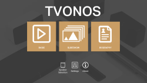
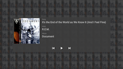
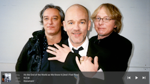
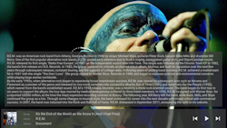

# TVONOS Public Information

Welcome to TVONOS. The App is designed to work with the excellent Sonos system and be a companion (not replacement) to the official Sonos Apps. The focus is on providing media rich displays on your TV for tracks playing on your Sonos system.

Currently Supported on:
* Android TV - OS version 9 (Pie) and above
* Amazon Fire TV/Stick - [OS version 7 and above](https://developer.amazon.com/docs/fire-tv/fire-os-overview.html)

To follow the status of TVONOS or to discuss any issues or ideas you can visit:
https://www.reddit.com/r/TVONOS/

Alternatively, if you find a problem or have an idea please share by raising an Issue (please check if there is already one before raisng anything new)

* Connection is to a single Sonos speaker (ideally the same room as the TV)
* Usage is limited to 1 hour a day while services are monitored
* This is a personal project used to try out Android TV development
* More features will be added as time allows

The real focus was displaying what was playing in 3 different views:

_Basic display - Just reads the current playing track info from the speaker_

_Slideshow - Will rotate through several images of the playing artist_

_Biography - Rotates through some biographies of the artist_

If you are interested in translating the App to a non-English language then please raise an issue and I will look at making the required files available. (As the app develops there will be more text strings to update, so please keep that in mind before volunteering - all translations offered are on a free of charge and no commitment agreement)
