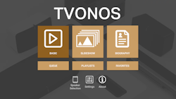
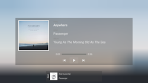
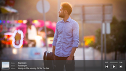
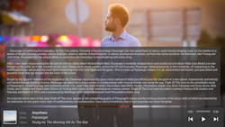
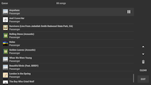
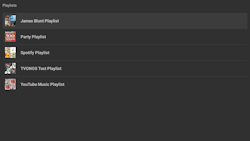
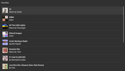

# TVONOS Public Information

Welcome to TVONOS. The App is designed to work with the excellent Sonos system and be a companion (not replacement) to the official Sonos Apps. The focus is on providing media rich displays on your TV for tracks playing on your Sonos system.

Currently Supported on:
* Android TV - OS version 9 (Pie) and above
* Amazon Fire TV/Stick - [OS version 7 and above](https://developer.amazon.com/docs/fire-tv/fire-os-overview.html)

To follow the status of TVONOS or to discuss any issues or ideas you can visit:
https://www.reddit.com/r/TVONOS/

Alternatively, if you find a problem or have an idea please share by raising an Issue (please check if there is already one before raisng anything new)

* Connection is to a single Sonos speaker (ideally the same room as the TV)
* Usage may be limited to 1 hour a day while services are monitored
* More features will be added as time allows

The real focus was displaying what was playing in 3 different views:

_Basic display - Just reads the current playing track info from the speaker_

_Slideshow - Will rotate through several images of the playing artist_

_Biography - Rotates through some biographies of the artist_

There is some limited support for managing what is playing:

_Queue - View and edit the current Sonos queue_

_Playlist - View and play a pre-configures Sonos Playlist_

_Favorites - View and play items in your Sonos Favorites_
